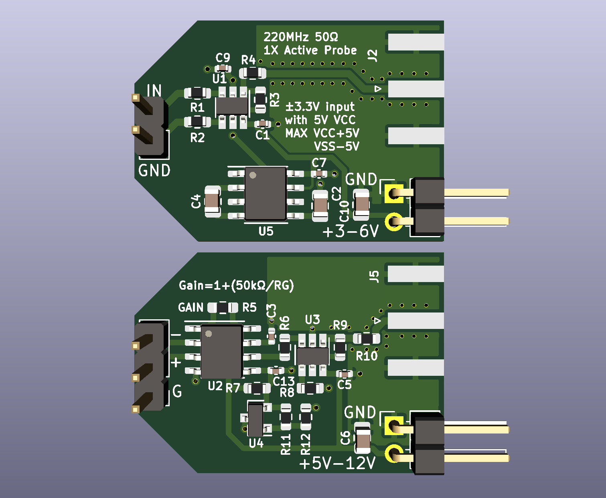

# Coax Probes

**⚠️ NOTE:** I designed this as a learning experience. I never tested it very much, don't expect it to work well. In particular note [the limited common mode voltage range of the INA128](https://github.com/mattico/coax-probe/issues/1) which means this probe can't properly measure anything below 2V.

Simple, cheap, nearly disposable active electronic probes.

See the `lmh6642` branch for an even cheaper version with less bandwidth.

## License

Licensed under the terms of the *CERN Open Hardware Licence Version 2 - Weakly Reciprocal* see [the LICENSE file](LICENSE) for details.
